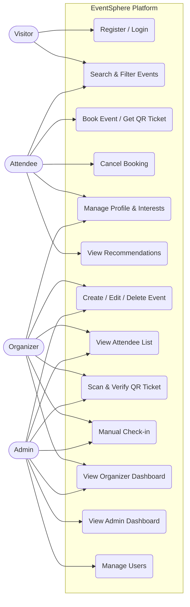
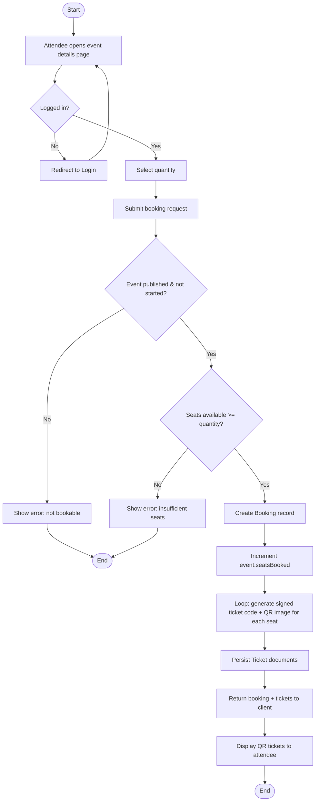
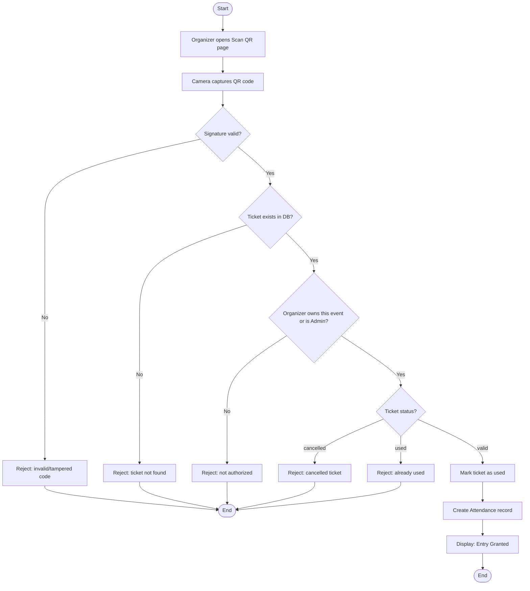
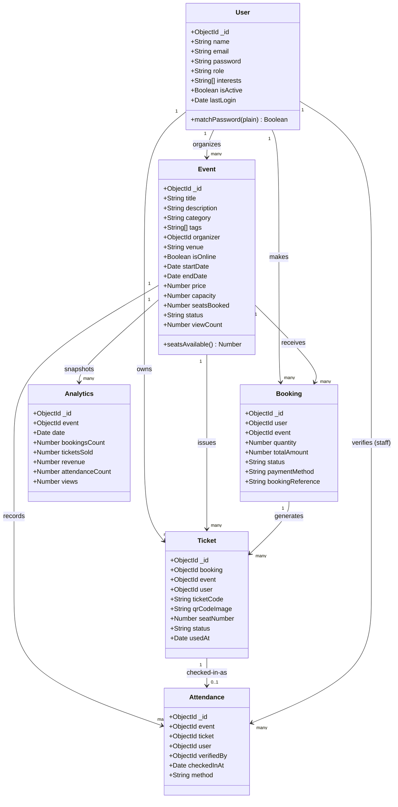
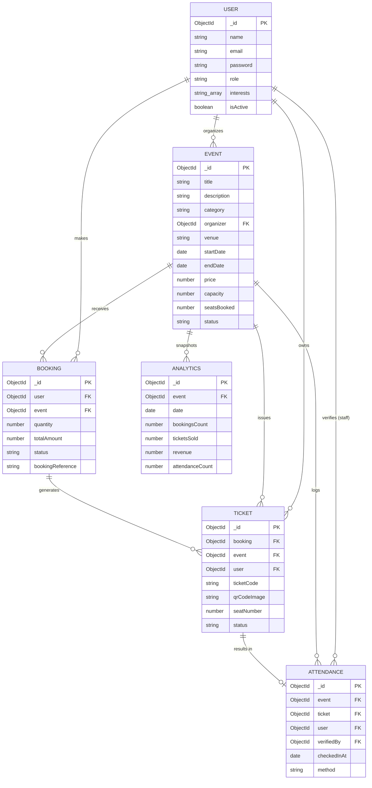
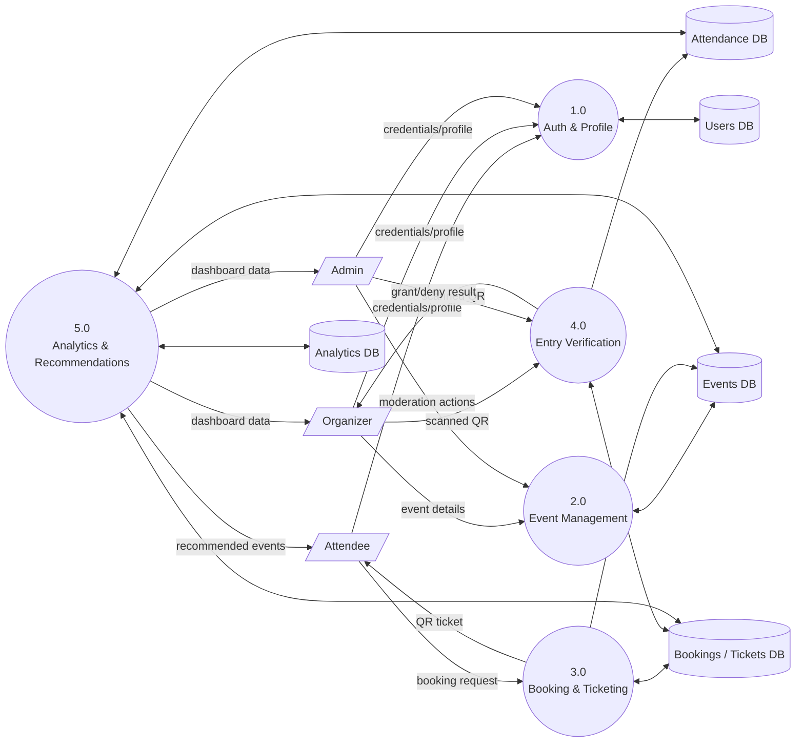
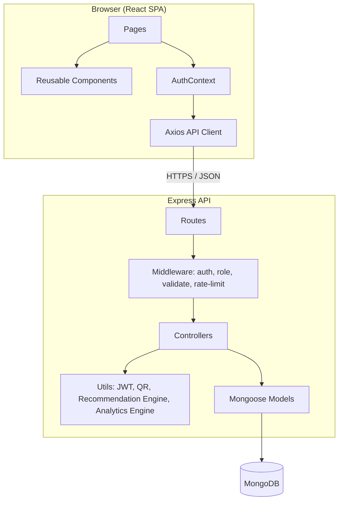

# UML & System Diagrams
## EventSphere — Smart Event Management Platform

All diagrams are written in [Mermaid](https://mermaid.js.org/) syntax and render directly on
GitHub. Mermaid has no dedicated "Use Case" or "DFD" diagram type, so those two are represented
using flowchart syntax with actor/process/data-store shapes, following common academic convention.

---

## 1. Use Case Diagram



---

## 2. Activity Diagram — Book Event & Generate Ticket



---

## 3. Activity Diagram — Scan & Verify Ticket at Entry



---

## 4. Sequence Diagram — Booking + QR Ticket Generation

```mermaid
sequenceDiagram
    actor Attendee
    participant FE as React Frontend
    participant API as Express API
    participant MW as Auth Middleware
    participant BC as BookingController
    participant DB as MongoDB
    participant QR as QR Util

    Attendee->>FE: Click "Book now"
    FE->>API: POST /api/bookings {eventId, quantity}
    API->>MW: protect() verifies JWT
    MW-->>API: req.user attached
    API->>BC: createBooking(req)
    BC->>DB: findById(event)
    DB-->>BC: event document
    BC->>BC: validate status, date, seat availability
    BC->>DB: Booking.create({...})
    BC->>DB: event.seatsBooked += quantity; save()
    loop for each seat
        BC->>QR: generateTicketCode()
        QR-->>BC: signed code
        BC->>QR: generateQRCodeImage(code)
        QR-->>BC: base64 QR image
        BC->>DB: Ticket.create({...})
    end
    BC-->>API: { booking, tickets }
    API-->>FE: 201 Created
    FE-->>Attendee: Show QR ticket(s)
```

---

## 5. Sequence Diagram — QR Ticket Verification at Entry

```mermaid
sequenceDiagram
    actor Organizer
    participant FE as React Frontend (Scanner)
    participant API as Express API
    participant TC as TicketController
    participant QR as QR Util
    participant DB as MongoDB

    Organizer->>FE: Point camera at attendee's QR code
    FE->>FE: html5-qrcode decodes text
    FE->>API: POST /api/tickets/verify {ticketCode}
    API->>TC: verifyTicket(req)
    TC->>QR: verifyTicketCode(ticketCode)
    QR-->>TC: signature valid? (bool)
    alt invalid signature
        TC-->>API: 400 invalid/tampered
        API-->>FE: Entry Denied
    else valid signature
        TC->>DB: Ticket.findOne({ticketCode})
        DB-->>TC: ticket or null
        alt not found / wrong organizer / already used / cancelled
            TC-->>API: 4xx with reason
            API-->>FE: Entry Denied + reason
        else valid & owned & unused
            TC->>DB: ticket.status = 'used'; save()
            TC->>DB: Attendance.create({...})
            TC-->>API: 200 Entry Granted
            API-->>FE: Entry Granted
        end
    end
    FE-->>Organizer: Show result (granted/denied)
```

---

## 6. Class Diagram (Domain Model)



---

## 7. Entity-Relationship (ER) Diagram



---

## 8. Data Flow Diagram (Level 1)



---

## 9. Component / Architecture Diagram


